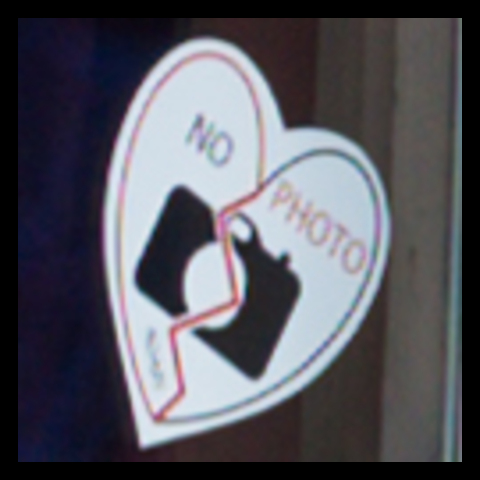

# Personal marks

By: impurify \<[have@anonymous.sex](mailto:have@anonymous.sex)\>

The files in this directory are proprietary, and intended for my development of an online visual identity.  Don’t be a rip-off.  I’m more concerned with originality and nonconfusion than with laws and such.

The first file is my original Github avatar, created 2025-01-05.  This file has a story to it, to be unfolded elsewhere.  A recipe for its creation is documented in file [how.sh](how.sh).



The file [`no-photo.jpg`](https://raw.githubusercontent.com/impurify/avatars/master/proprietary/no-photo.jpg) that I uploaded to Github was last-modified 2025-01-05T15:32:25.851171652Z, and it has the following SHA256 sum:

```
8a788dc5f0dab24691c7f3c5b15e57b6f7b9baca1f2ee318648109259b8549ba  no-photo.jpg
```

Github stripped the metadata that I’d intentionally added with `exiftool`.  Casual plagiarism of images is rampant online; it is unacceptable to me for my avatar to be published without metadata.  (TODO: File a ticket with Github about this.)  Github also significantly reduced the JPEG quality.

I now prefer the losslessly converted [progressive JPEG version](https://raw.githubusercontent.com/impurify/avatars/master/proprietary/no-photo.jpg).  The file size is smaller, and it is better for this use case.

I have changed my Github avatar anyway, for political reasons.  However, this is a handy place to archive my old avatar, which I will elsewhere as a personal trademark.
